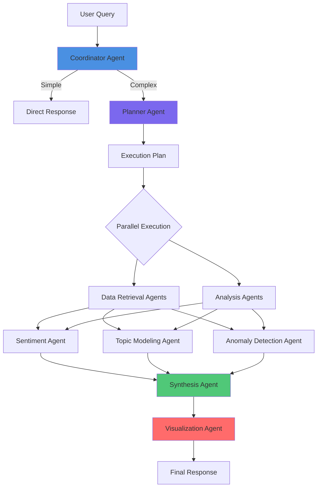

# Design Document

## Overview

The Product Review Analysis Workflow is an advanced multi-agent system built on LlamaIndex's Workflow framework. It enables users to query their review datasets using natural language, with intelligent routing, parallel execution, adaptive planning, and comprehensive execution tracking. The system supports multiple output formats including markdown reports, visualizations, and structured data.

### Key Design Principles

1. **Modularity**: Each agent is a specialized, independent component with clear responsibilities
2. **Adaptability**: ReAct pattern enables dynamic plan adjustment based on intermediate results
3. **Observability**: Every agent action is tracked in Chat Message Steps for transparency
4. **Scalability**: Parallel execution, caching, and query optimization for large datasets
5. **Resilience**: Graceful degradation when agents fail, with meaningful error messages

## Architecture

### High-Level Flow



### Agent Hierarchy

```
Coordinator Agent (Entry Point)
├── Simple Response Handler
└── Planner Agent
    ├── Data Retrieval Coordinator
    │   ├── EDA Metadata Fetcher
    │   ├── SQL Query Generator
    │   └── Vector Search Handler
    ├── Analysis Coordinator
    │   ├── Sentiment Analysis Agent
    │   ├── Topic Modeling Agent
    │   ├── Anomaly Detection Agent
    │   └── Summary Agent
    ├── Synthesis Agent
    └── Visualization Agent
```

## Components and Interfaces

### 0. Orchestration Layer (Workflow Engine)

**Purpose**: Central state machine that manages execution plan, coordinates parallel agents, handles retries, and ensures thread-safe state updates.

**Interface**:
```python
class WorkflowOrchestrator:
    async def execute_plan(
        self,
        context: ExecutionContext,
        plan: ExecutionPlan
    ) -> ExecutionResult
    
    async def execute_step(
        self,
        context: ExecutionContext,
        step: PlanStep
    ) -> StepResult
    
    async def execute_parallel_steps(
        self,
        context: ExecutionContext,
        steps: List[PlanStep]
    ) -> Dict[str, StepResult]
    
    async def handle_step_failure(
        self,
        context: ExecutionContext,
        step: PlanStep,
        error: Exception
    ) -> RetryDecision
```

**Responsibilities**:
- Execute ExecutionPlan steps in correct order
- Manage parallel execution with asyncio.gather
- Safely update ExecutionContext.agent_outputs with locks
- Implement retry logic from RetryConfig
- Collect and consolidate results for Synthesis Agent
- Track execution state and handle failures gracefully
- Emit streaming events for each step

**Implementation Pattern**:
```python
class WorkflowOrchestrator:
    def __init__(self, retry_config: RetryConfig):
        self.retry_config = retry_config
    
    async def execute_plan(
        self,
        context: ExecutionContext,
        plan: ExecutionPlan
    ) -> ExecutionResult:
        """Execute plan with dependency management and parallel execution."""
        
        # Group steps by dependency level for parallel execution
        execution_levels = self._build_execution_levels(plan)
        
        for level_steps in execution_levels:
            if len(level_steps) == 1:
                # Single step - execute directly
                result = await self.execute_step(context, level_steps[0])
                async with context.lock:
                    context.agent_outputs[level_steps[0].step_id] = result
                    context.completed_steps.add(level_steps[0].step_id)
            else:
                # Multiple steps - execute in parallel
                results = await self.execute_parallel_steps(context, level_steps)
                async with context.lock:
                    for step_id, result in results.items():
                        context.agent_outputs[step_id] = result
                        context.completed_steps.add(step_id)
        
        return ExecutionResult(
            success=True,
            outputs=context.agent_outputs,
            insights=context.insights
        )
    
    async def execute_parallel_steps(
        self,
        context: ExecutionContext,
        steps: List[PlanStep]
    ) -> Dict[str, StepResult]:
        """Execute multiple steps in parallel with error handling."""
        
        tasks = [
            self._execute_step_with_retry(context, step)
            for step in steps
        ]
        
        results = await asyncio.gather(*tasks, return_exceptions=True)
        
        output = {}
        for step, result in zip(steps, results):
            if isinstance(result, Exception):
                logger.error(f"Step {step.step_id} failed: {result}")
                async with context.lock:
                    context.failed_steps[step.step_id] = str(result)
                output[step.step_id] = StepResult(
                    success=False,
                    error=str(result)
                )
            else:
                output[step.step_id] = result
        
        return output
    
    def _build_execution_levels(
        self,
        plan: ExecutionPlan
    ) -> List[List[PlanStep]]:
        """Group steps by dependency level for parallel execution."""
        levels = []
        completed = set()
        
        while len(completed) < len(plan.steps):
            # Find steps whose dependencies are all completed
            current_level = [
                step for step in plan.steps
                if step.step_id not in completed
                and all(dep in completed for dep in step.depends_on)
            ]
            
            if not current_level:
                raise ValueError("Circular dependency detected in execution plan")
            
            levels.append(current_level)
            completed.update(step.step_id for step in current_level)
        
        return levels
```

### 1. Coordinator Agent

**Purpose**: Entry point that classifies queries and routes to appropriate handlers.

**Interface**:
```python
class CoordinatorAgent:
    async def classify_query(self, query: str, user_id: str) -> QueryClassification
    async def route_query(self, classification: QueryClassification) -> AgentResponse
```

**Responsibilities**:
- Classify query complexity (simple/medium/complex)
- Determine if data retrieval is needed
- Route simple queries directly to response
- Delegate complex queries to Planner Agent
- Track execution start in Chat Message Steps

**Implementation Details**:
- Uses LLM to analyze query intent
- Checks for keywords indicating data needs
- Considers user's available datasets
- Emits `agent_step_start` and `agent_step_complete` events

### 2. Planner Agent (Iterative ReAct)

**Purpose**: Determines the next best action based on current state, implementing true adaptive planning.

**Interface**:
```python
class PlannerAgent:
    async def determine_next_action(
        self, 
        query: str,
        context: ExecutionContext,
        previous_results: Dict[str, Any]
    ) -> NextAction
    
    async def is_query_complete(
        self,
        query: str,
        context: ExecutionContext
    ) -> bool
```

**Responsibilities**:
- Determine single next best action based on query and current state
- Generate reasoning trace explaining the decision
- Decide if query is complete or more actions needed
- Adapt strategy based on previous action results
- Handle unexpected results by pivoting strategy

**Iterative ReAct Flow**:
```python
@dataclass
class ThoughtStep:
    """Reasoning step before taking action."""
    step_id: str
    rationale: str  # Detailed explanation of why this action is needed
    alternatives_considered: List[str]  # Other options that were rejected
    expected_outcome: str  # What we expect to learn from this action

@dataclass
class NextAction:
    """Single next action to take."""
    action_id: str
    agent_type: str  # "data_retrieval", "sentiment", "topic", etc.
    action: str  # Specific action to perform
    parameters: Dict[str, Any]
    thought: ThoughtStep  # Reasoning behind this action
    can_run_parallel_with: List[str]  # Other action_ids that can run concurrently
    is_final: bool  # True if this is the last action before synthesis
```

**Example Iterative Planning**:
```python
# Turn 1: Initial query "What are my main product gaps?"
thought_1 = ThoughtStep(
    step_id="thought_1",
    rationale="The user wants to identify product gaps. I need to first understand what data is available.",
    alternatives_considered=["Start with topic modeling", "Start with sentiment analysis"],
    expected_outcome="I will learn which datasets exist, their size, and what fields are available for analysis."
)
action_1 = NextAction(
    action_id="action_1",
    agent_type="data_retrieval",
    action="get_user_datasets_with_eda",
    parameters={"user_id": "user_123"},
    thought=thought_1,
    can_run_parallel_with=[],
    is_final=False
)

# Turn 2: After seeing EDA results
thought_2 = ThoughtStep(
    step_id="thought_2",
    rationale="I see the user has 45 reviews with ratings 1-5. To find gaps, I should identify negative themes. I'll run topic modeling on low-rated reviews AND sentiment analysis on all reviews in parallel.",
    alternatives_considered=["Only topic modeling", "Only sentiment analysis"],
    expected_outcome="Topic modeling will reveal common complaint themes. Sentiment analysis will show which aspects are most negative."
)
action_2a = NextAction(
    action_id="action_2a",
    agent_type="topic_modeling",
    action="identify_topics",
    parameters={"rating_filter": "<=2", "num_topics": 5},
    thought=thought_2,
    can_run_parallel_with=["action_2b"],
    is_final=False
)
action_2b = NextAction(
    action_id="action_2b",
    agent_type="sentiment",
    action="aspect_sentiment_analysis",
    parameters={"aspects": ["features", "usability", "performance"]},
    thought=thought_2,
    can_run_parallel_with=["action_2a"],
    is_final=False
)

# Turn 3: After analysis results
thought_3 = ThoughtStep(
    step_id="thought_3",
    rationale="I have identified 3 main negative topics and aspect sentiments. I have enough information to answer the query. Time to synthesize.",
    alternatives_considered=["Run anomaly detection", "Get more reviews"],
    expected_outcome="A comprehensive report on product gaps with evidence."
)
action_3 = NextAction(
    action_id="action_3",
    agent_type="synthesis",
    action="synthesize_insights",
    parameters={"format": "markdown"},
    thought=thought_3,
    can_run_parallel_with=[],
    is_final=True
)
```

### Conversational Context and Follow-up Queries

**Purpose**: Enable multi-turn conversations where follow-up queries leverage previous results.

**Implementation**:
```python
class ConversationalContextManager:
    async def save_context(
        self,
        session_id: str,
        query: str,
        insights: List[Insight],
        agent_outputs: Dict[str, Any]
    ) -> None:
        """Save execution results for future reference."""
        pass
    
    async def load_context(
        self,
        session_id: str
    ) -> Optional[ExecutionContext]:
        """Load previous context for follow-up queries."""
        pass
    
    async def is_follow_up_query(
        self,
        query: str,
        previous_context: ExecutionContext
    ) -> bool:
        """Determine if query references previous results."""
        pass
```

**Follow-up Query Examples**:
```python
# Initial query: "What are my main product gaps?"
# System generates insights and caches results

# Follow-up 1: "Show me the reviews for the biggest gap"
# Planner recognizes reference to previous results
# Creates simple plan: retrieve reviews for top insight
# No need to re-run topic modeling

# Follow-up 2: "Compare that to last month"
# Planner uses cached topic from previous query
# Runs topic modeling only on last month's data
# Generates comparison visualization

# Follow-up 3: "What about positive feedback?"
# Planner pivots to positive sentiment analysis
# Uses same dataset from initial query
# Faster execution by reusing data retrieval
```

### 3. Data Retrieval Agent

**Purpose**: Fetches data from user datasets using EDA metadata for optimization.

**Interface**:
```python
class DataRetrievalAgent:
    async def get_user_datasets_with_eda(self, user_id: str) -> List[DatasetWithEDA]
    async def query_reviews(
        self,
        user_id: str,
        filters: Dict[str, Any],
        limit: int = 1000
    ) -> QueryResult
    async def semantic_search(
        self,
        user_id: str,
        query_text: str,
        top_k: int = 50
    ) -> List[Review]
```

**Responsibilities**:
- Retrieve all datasets for a user with EDA metadata
- Construct optimized SQL queries using EDA statistics
- Execute vector similarity search for semantic queries
- Handle pagination for large result sets
- Cache frequently accessed data
- Track tool calls in Chat Message Steps

**EDA Metadata Usage**:
- Use `distinct_count` to decide between IN clause vs range
- Use `top_values` to optimize WHERE clauses
- Use `min/max` for date range queries
- Use `null_count` to avoid unnecessary NULL checks

**Tool Definitions**:
```python
@tool
def get_user_datasets_with_eda(user_id: str) -> List[Dict]:
    """
    Retrieve all datasets for a user along with EDA metadata.
    
    Returns:
        List of datasets with schema:
        {
            "dataset_id": str,
            "table_name": str,
            "row_count": int,
            "eda": {
                "column_stats": {...},
                "summary": str,
                "insights": [...]
            }
        }
    """
    pass

@tool
def query_reviews(
    user_id: str,
    table_name: str = None,
    rating_filter: str = None,  # ">=4", "<=2", etc.
    date_range: Tuple[str, str] = None,
    source_filter: List[str] = None,
    text_contains: str = None,
    limit: int = 1000
) -> Dict:
    """
    Query reviews with filters.
    
    Returns:
        {
            "reviews": List[Dict],
            "total_count": int,
            "query_info": {...}
        }
    """
    pass

@tool
def semantic_search_reviews(
    user_id: str,
    query_text: str,
    top_k: int = 50,
    rating_filter: str = None
) -> List[Dict]:
    """
    Semantic search using vector embeddings.
    
    Returns list of reviews with similarity scores.
    """
    pass
```

### 4. Specialized Analysis Agents

#### 4.1 Sentiment Analysis Agent

**Purpose**: Performs aspect-based sentiment analysis and generates standardized insights.

**Interface**:
```python
class SentimentAnalysisAgent:
    async def analyze_sentiment(
        self,
        reviews: List[Dict],
        aspects: List[str] = None
    ) -> List[Insight]
    
    async def generate_thought(
        self,
        reviews: List[Dict],
        aspects: List[str] = None
    ) -> str
```

**Capabilities**:
- Overall sentiment classification (positive/negative/neutral)
- Aspect-based sentiment (e.g., "battery: positive, camera: negative")
- Sentiment intensity scoring (0-1 scale)
- Emotion detection (joy, anger, frustration, etc.)
- Generate Insight objects for each finding

**Output Structure**:
```python
# Returns List[Insight] instead of complex SentimentResult
# Example insights:
[
    Insight(
        source_agent="sentiment",
        insight_text="Performance aspect has 78% negative sentiment across 35 reviews",
        severity_score=0.78,
        confidence_score=0.92,
        supporting_reviews=["rev_123", "rev_456", ...],
        visualization_hint="bar_chart",
        visualization_data={
            "x": ["Performance", "Features", "Support"],
            "y": [0.78, 0.45, 0.62],
            "chart_type": "bar",
            "title": "Negative Sentiment by Aspect"
        },
        metadata={"aspect": "performance", "total_reviews": 35}
    ),
    Insight(
        source_agent="sentiment",
        insight_text="Sentiment has declined 15% over the past month",
        severity_score=0.65,
        confidence_score=0.85,
        supporting_reviews=["rev_789", ...],
        visualization_hint="line_chart",
        visualization_data={
            "x": ["Week 1", "Week 2", "Week 3", "Week 4"],
            "y": [0.70, 0.68, 0.62, 0.55],
            "chart_type": "line",
            "title": "Sentiment Trend Over Time"
        },
        metadata={"trend": "declining"}
    )
]
```

#### 4.2 Topic Modeling Agent

**Purpose**: Identifies recurring themes and generates insights about topic patterns.

**Interface**:
```python
class TopicModelingAgent:
    async def identify_topics(
        self,
        reviews: List[Dict],
        num_topics: int = 10,
        min_topic_size: int = 5
    ) -> List[Insight]
    
    async def generate_thought(
        self,
        reviews: List[Dict],
        num_topics: int = 10
    ) -> str
```

**Capabilities**:
- Extract main topics using LDA or BERTopic
- Group similar reviews by topic
- Identify topic trends over time
- Generate Insight objects for each significant topic

**Output Structure**:
```python
# Returns List[Insight] instead of complex TopicResult
# Example insights:
[
    Insight(
        source_agent="topic_modeling",
        insight_text="'UI Slowness' is the most frequent complaint, appearing in 18 reviews (40%)",
        severity_score=0.85,
        confidence_score=0.90,
        supporting_reviews=["rev_101", "rev_102", ...],
        visualization_hint="bar_chart",
        visualization_data={
            "x": ["UI Slowness", "App Crashes", "Missing Features", "Poor Support"],
            "y": [18, 12, 8, 7],
            "chart_type": "bar",
            "title": "Top Complaint Topics"
        },
        metadata={
            "topic_id": "topic_1",
            "keywords": ["slow", "laggy", "unresponsive", "freeze"],
            "avg_rating": 1.8
        }
    ),
    Insight(
        source_agent="topic_modeling",
        insight_text="'App Crashes' complaints have increased 3x in the last 2 weeks",
        severity_score=0.92,
        confidence_score=0.88,
        supporting_reviews=["rev_201", "rev_202", ...],
        visualization_hint="line_chart",
        visualization_data={
            "x": ["Week 1", "Week 2", "Week 3", "Week 4"],
            "y": [2, 3, 5, 12],
            "chart_type": "line",
            "title": "App Crashes Trend"
        },
        metadata={
            "topic_id": "topic_2",
            "trend": "increasing",
            "growth_rate": 3.0
        }
    )
]
```

#### 4.3 Anomaly Detection Agent

**Purpose**: Detects unusual patterns and generates critical alerts as insights.

**Interface**:
```python
class AnomalyDetectionAgent:
    async def detect_anomalies(
        self,
        reviews: List[Dict],
        time_window: str = "daily"
    ) -> List[Insight]
    
    async def generate_thought(
        self,
        reviews: List[Dict]
    ) -> str
```

**Capabilities**:
- Detect sudden spikes in negative reviews
- Identify unusual topic emergence
- Flag rating distribution changes
- Detect source-specific anomalies
- Generate high-severity insights for critical issues

**Output Structure**:
```python
# Returns List[Insight] for detected anomalies
# Example insights:
[
    Insight(
        source_agent="anomaly_detection",
        insight_text="CRITICAL: 1-star reviews spiked 400% on Oct 10th (12 reviews vs 3 avg)",
        severity_score=0.95,
        confidence_score=0.93,
        supporting_reviews=["rev_301", "rev_302", ...],
        visualization_hint="line_chart",
        visualization_data={
            "x": ["Oct 8", "Oct 9", "Oct 10", "Oct 11", "Oct 12"],
            "y": [3, 2, 12, 4, 3],
            "chart_type": "line",
            "title": "1-Star Review Spike",
            "annotations": [{"x": "Oct 10", "text": "Spike detected"}]
        },
        metadata={
            "anomaly_type": "rating_spike",
            "baseline": 3.0,
            "spike_value": 12,
            "spike_date": "2025-10-10",
            "recommended_action": "Investigate app version released on Oct 9th"
        }
    )
]
```

#### 4.4 Summary Agent

**Purpose**: Creates concise summaries and generates overview insights.

**Interface**:
```python
class SummaryAgent:
    async def summarize_reviews(
        self,
        reviews: List[Dict],
        summary_type: str = "extractive",  # or "abstractive"
        max_length: int = 500
    ) -> List[Insight]
    
    async def generate_thought(
        self,
        reviews: List[Dict]
    ) -> str
```

**Capabilities**:
- Extractive summarization (key sentences)
- Abstractive summarization (generated text)
- Multi-document summarization
- Aspect-focused summaries
- Generate overview insights

**Output Structure**:
```python
# Returns List[Insight] with summary information
# Example insights:
[
    Insight(
        source_agent="summary",
        insight_text="Overall: Users praise content quality but criticize app performance and missing features",
        severity_score=0.60,
        confidence_score=0.88,
        supporting_reviews=["rev_401", "rev_402", ...],
        visualization_hint=None,
        visualization_data=None,
        metadata={
            "summary_type": "abstractive",
            "key_points": [
                "Content quality is highly rated",
                "Performance issues are widespread",
                "Users request more customization features"
            ],
            "total_reviews_summarized": 45
        }
    )
]
```

### 5. Synthesis Agent

**Purpose**: Combines standardized insights from multiple agents into a coherent narrative response.

**Interface**:
```python
class SynthesisAgent:
    async def synthesize_response(
        self,
        query: str,
        insights: List[Insight],
        format_type: str = "markdown"
    ) -> SynthesisResult
    
    async def generate_synthesis_plan(
        self,
        query: str,
        insights: List[Insight]
    ) -> SynthesisThought
```

**Responsibilities**:
- Generate synthesis plan (thought) before creating response
- Combine standardized insights into narrative
- Organize information by severity and relevance
- Create narrative flow with transitions
- Embed visualizations at appropriate locations
- Add source citations with review excerpts
- Prioritize most relevant insights

**Synthesis with Reasoning**:
```python
@dataclass
class SynthesisThought:
    """Synthesis agent's plan before generating response."""
    outline: List[str]  # Section headings in order
    key_insights: List[str]  # insight_ids to highlight
    visualization_placements: Dict[str, int]  # insight_id -> section_index
    narrative_strategy: str  # "problem-solution", "chronological", "severity-based"
    reasoning: str  # Why this structure was chosen

@dataclass
class SynthesisResult:
    response: str  # Final markdown response
    thought: SynthesisThought  # The plan that was executed
    insights_used: List[str]  # insight_ids that were included
    insights_omitted: List[str]  # insight_ids that were excluded and why
```

**Synthesis Strategy**:
1. **Generate Thought**: Create synthesis plan based on insights
2. **Introduction**: Restate query and summarize approach
3. **Key Findings**: Highlight top 3-5 insights by severity
4. **Detailed Analysis**: Present insights grouped by theme
5. **Visualizations**: Embed charts with explanations
6. **Recommendations**: Actionable next steps
7. **Sources**: Citations with review excerpts

**Example Synthesis Thought**:
```python
thought = SynthesisThought(
    outline=[
        "Executive Summary",
        "Top 3 Product Gaps",
        "Gap 1: UI Performance Issues",
        "Gap 2: Feature Limitations",
        "Gap 3: Customer Support Quality",
        "Recommendations",
        "Supporting Evidence"
    ],
    key_insights=["insight_topic_1", "insight_sentiment_2", "insight_anomaly_1"],
    visualization_placements={
        "insight_topic_1": 2,  # Bar chart in "Top 3 Product Gaps" section
        "insight_sentiment_2": 4  # Sentiment trend in "Gap 2" section
    },
    narrative_strategy="severity-based",
    reasoning="I will organize by severity because the user asked for 'main' gaps, implying they want the most critical issues first. I'll use topic modeling results as the primary structure, enriched with sentiment data for each gap."
)
```

### 6. Visualization Agent

**Purpose**: Generates charts and graphs from analysis results.

**Interface**:
```python
class VisualizationAgent:
    async def generate_visualization(
        self,
        data: Dict[str, Any],
        chart_type: str,
        title: str,
        labels: Dict[str, str] = None
    ) -> VisualizationResult
```

**Supported Chart Types**:
- Bar charts (comparisons, distributions)
- Line charts (trends over time)
- Pie charts (proportions)
- Scatter plots (correlations)
- Heatmaps (multi-dimensional data)

**Implementation**:
```python
import plotly.graph_objects as go
import plotly.express as px
from pathlib import Path
import uuid

class VisualizationAgent:
    def __init__(self, output_dir: str = "static/visualizations"):
        self.output_dir = Path(output_dir)
        self.output_dir.mkdir(parents=True, exist_ok=True)
    
    async def generate_visualization(
        self,
        data: Dict[str, Any],
        chart_type: str,
        title: str,
        labels: Dict[str, str] = None
    ) -> VisualizationResult:
        # Generate unique filename
        viz_id = str(uuid.uuid4())
        filename = f"{viz_id}.png"
        filepath = self.output_dir / filename
        
        # Create chart based on type
        if chart_type == "bar":
            fig = go.Figure(data=[
                go.Bar(x=data["x"], y=data["y"], name=data.get("name", ""))
            ])
        elif chart_type == "line":
            fig = go.Figure(data=[
                go.Scatter(x=data["x"], y=data["y"], mode="lines+markers")
            ])
        # ... other chart types
        
        # Update layout
        fig.update_layout(
            title=title,
            xaxis_title=labels.get("x", "X"),
            yaxis_title=labels.get("y", "Y"),
            template="plotly_white"
        )
        
        # Save as PNG
        fig.write_image(str(filepath))
        
        return VisualizationResult(
            filepath=f"/static/visualizations/{filename}",
            chart_type=chart_type,
            title=title
        )
```

## Data Models

### User Dataset with EDA

```python
@dataclass
class DatasetWithEDA:
    dataset_id: str
    user_id: str
    table_name: str
    dynamic_table_name: str  # __user_{id}_{table_name}
    row_count: int
    eda: EDAMetadata
    created_at: datetime
    updated_at: datetime

@dataclass
class EDAMetadata:
    column_stats: Dict[str, ColumnStats]
    summary: str
    insights: List[FieldInsight]

@dataclass
class ColumnStats:
    non_null_count: int
    null_count: int
    dtype: str
    min: Optional[Any]
    max: Optional[Any]
    mean: Optional[float]
    median: Optional[float]
    distinct_count: int
    top_values: Optional[Dict[str, int]]
    sample_values: List[Any]

@dataclass
class FieldInsight:
    field_name: str
    data_type: str
    description: str
    unique_value_count: int
    top_values: Optional[List[str]]
```

### Chat Message Step with Reasoning Traces

```python
class ChatMessageStep(Base):
    """Tracks individual agent execution steps with explicit reasoning."""
    __tablename__ = "chat_message_steps"
    
    id: str  # UUID
    message_id: str  # FK to chat_messages
    agent_name: str
    step_order: int
    
    # The "Thinking" part - agent's reasoning before action
    thought: Optional[str]  # Agent's inner monologue explaining what it will do and why
    
    # The "Action" or "Output" part (one of these will be populated)
    tool_call: Optional[Dict]  # {"tool_name": str, "parameters": dict, "result": any}
    structured_output: Optional[Dict]  # For Pydantic models
    prediction: Optional[str]  # For text outputs
    
    created_at: datetime

# Example: DataRetrievalAgent execution creates two steps:
# Step 1 (Thought): thought="I need to find negative reviews to identify product gaps. 
#                          I will use query_reviews with rating_filter <=2."
# Step 2 (Action): tool_call={"tool_name": "query_reviews", "parameters": {"rating_filter": "<=2"}}
```

### Execution Context with Conversational State

```python
@dataclass
class ExecutionContext:
    """Shared context across workflow execution and conversation turns."""
    user_id: str
    session_id: str
    message_id: str
    query: str
    user_datasets: List[DatasetWithEDA]
    
    # Current execution state
    current_step: Optional[str]  # Current step_id being executed
    execution_plan: Optional[ExecutionPlan]
    agent_outputs: Dict[str, Any]  # step_id -> output
    insights: List[Insight]  # Standardized insights from all agents
    
    # Conversational context (persisted across turns)
    conversation_history: List[Dict[str, Any]]  # Previous queries and results
    cached_results: Dict[str, Any]  # Results from previous turns for follow-ups
    last_visualization_data: Optional[Dict]  # For "show me more" queries
    
    # Caching and optimization
    cache: Dict[str, Any]  # For caching intermediate results
    feedback_history: List[FeedbackRecord]  # Historical feedback for learning
    
    # State management
    lock: asyncio.Lock  # For thread-safe updates in parallel execution
    completed_steps: Set[str]  # Track completed step_ids
    failed_steps: Dict[str, str]  # step_id -> error_message
```

### Standardized Insight Format

```python
@dataclass
class Insight:
    """Standardized insight format for all analysis agents."""
    source_agent: str  # "topic_modeling", "sentiment", "anomaly", etc.
    insight_text: str  # Human-readable finding
    severity_score: float  # 0.0 to 1.0, importance/urgency
    confidence_score: float  # 0.0 to 1.0, confidence in finding
    supporting_reviews: List[str]  # Review IDs as evidence
    visualization_hint: Optional[str]  # "bar_chart", "line_chart", "pie_chart", etc.
    visualization_data: Optional[Dict]  # Data for chart generation
    metadata: Dict[str, Any]  # Additional context
    
    def to_markdown(self) -> str:
        """Convert insight to markdown format."""
        severity_emoji = "🔴" if self.severity_score > 0.7 else "🟡" if self.severity_score > 0.4 else "🟢"
        return f"{severity_emoji} **{self.insight_text}** (confidence: {self.confidence_score:.0%})"
```

## Error Handling

### Error Classification

```python
class ErrorType(Enum):
    VALIDATION_ERROR = "validation"
    EXECUTION_ERROR = "execution"
    DATA_QUALITY_ERROR = "data_quality"
    TIMEOUT_ERROR = "timeout"
    AGENT_FAILURE = "agent_failure"
```

### Error Handling Strategy

1. **Validation Errors**: Caught during plan creation, trigger plan refinement
2. **Execution Errors**: Logged, partial results returned, fallback agents activated
3. **Data Quality Errors**: Trigger ReAct loop to adjust queries
4. **Timeout Errors**: Return partial results with timeout indication
5. **Agent Failures**: Continue with remaining agents, mark step as failed

### Retry Logic

```python
class RetryConfig:
    max_retries: int = 3
    backoff_factor: float = 2.0
    retry_on: List[ErrorType] = [
        ErrorType.EXECUTION_ERROR,
        ErrorType.TIMEOUT_ERROR
    ]
```

## Testing Strategy

### Unit Tests

- Test each agent independently with mock data
- Test tool functions with various input combinations
- Test EDA metadata parsing and optimization logic
- Test visualization generation with different chart types

### Integration Tests

- Test complete workflow execution with sample queries
- Test parallel agent execution and synchronization
- Test ReAct loop with simulated failures
- Test Chat Message Step creation and retrieval

### End-to-End Tests

- Test real user queries against test datasets
- Test streaming response generation
- Test visualization embedding in responses
- Test feedback loop and learning mechanisms

### Performance Tests

- Test with large datasets (1M+ reviews)
- Test parallel execution scalability
- Test caching effectiveness
- Test query optimization impact

## Deployment Considerations

### Infrastructure Requirements

- **Database**: PostgreSQL with pgvector extension for embeddings
- **Cache**: Redis for query result caching
- **Storage**: File system or S3 for visualization images
- **Compute**: Async workers for parallel agent execution

### Monitoring

- Track agent execution times per step
- Monitor cache hit rates
- Log slow queries for optimization
- Track user feedback scores per agent type

### Scalability

- Horizontal scaling of worker processes
- Database read replicas for data retrieval
- CDN for visualization images
- Query result caching with TTL

## Security Considerations

- User data isolation (row-level security)
- SQL injection prevention (parameterized queries)
- Rate limiting per user
- API key authentication
- Audit logging of all data access
