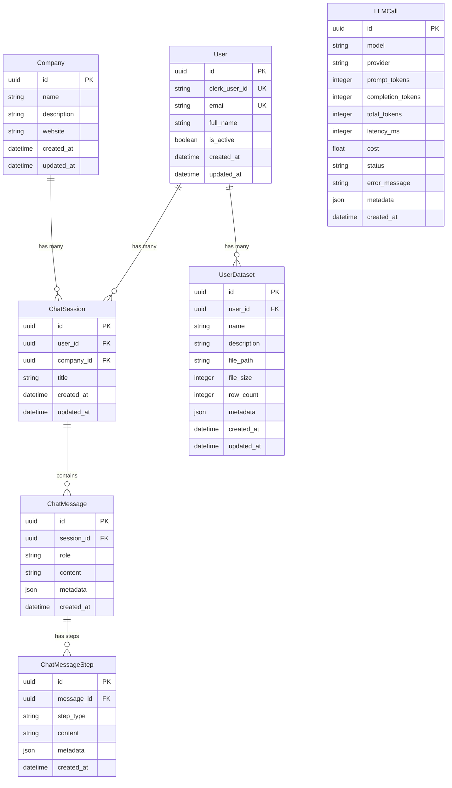

# Design Document

## Overview

This document outlines the design for a simplified FastAPI backend system in the `back_end` folder. The system focuses on core chat functionality with LLM integration and user dataset management, removing unnecessary complexity from the existing backend. The architecture follows FastAPI best practices with async/await patterns, repository pattern for data access, and Pydantic v2 for validation.

### Key Design Principles

1. **Simplicity First**: Only include essential tables and functionality
2. **Async Throughout**: Use async/await for all I/O operations
3. **Type Safety**: Comprehensive type hints using Python 3.11+ features
4. **Repository Pattern**: Abstract database operations for testability
5. **Pydantic v2**: Modern validation with clear API contracts
6. **Configuration Management**: Environment-based settings with validation

## Architecture

### High-Level Architecture

```
┌─────────────────────────────────────────────────────────────┐
│                      FastAPI Application                     │
├─────────────────────────────────────────────────────────────┤
│  API Layer (app/api/v1/)                                    │
│  ├── Health Endpoint                                         │
│  ├── User Endpoints                                          │
│  ├── Company Endpoints                                       │
│  ├── Chat Endpoints                                          │
│  └── User Dataset Endpoints                                  │
├─────────────────────────────────────────────────────────────┤
│  Service Layer (app/services/)                              │
│  ├── User Service                                            │
│  ├── Company Service                                         │
│  ├── Chat Service                                            │
│  └── User Dataset Service                                    │
├─────────────────────────────────────────────────────────────┤
│  Repository Layer (app/database/repositories/)              │
│  ├── Base Repository (CRUD operations)                      │
│  ├── User Repository                                         │
│  ├── Company Repository                                      │
│  ├── Chat Session Repository                                │
│  ├── Chat Message Repository                                │
│  ├── Chat Message Step Repository                           │
│  ├── LLM Call Repository                                     │
│  └── User Dataset Repository                                 │
├─────────────────────────────────────────────────────────────┤
│  Database Layer (app/database/models/)                      │
│  └── SQLAlchemy Models (7 tables)                           │
└─────────────────────────────────────────────────────────────┘
                            │
                            ▼
                  ┌──────────────────┐
                  │  PostgreSQL DB   │
                  │   (needle_ai)    │
                  └──────────────────┘
```

### Directory Structure

```
back_end/
├── app/
│   ├── __init__.py
│   ├── main.py                          # FastAPI application entry point
│   ├── dependencies.py                  # Dependency injection
│   │
│   ├── api/
│   │   ├── __init__.py
│   │   ├── deps.py                      # API dependencies
│   │   └── v1/
│   │       ├── __init__.py
│   │       ├── router.py                # Main API router
│   │       ├── health.py                # Health check endpoint
│   │       ├── users.py                 # User endpoints
│   │       ├── companies.py             # Company endpoints
│   │       ├── chat.py                  # Chat endpoints
│   │       └── user_datasets.py         # User dataset endpoints
│   │
│   ├── core/
│   │   ├── __init__.py
│   │   └── config/
│   │       ├── __init__.py
│   │       ├── settings.py              # Pydantic settings
│   │       └── environments.py          # Environment configs
│   │
│   ├── database/
│   │   ├── __init__.py
│   │   ├── base.py                      # Base model class
│   │   ├── session.py                   # Database session management
│   │   ├── models/
│   │   │   ├── __init__.py
│   │   │   ├── user.py
│   │   │   ├── company.py
│   │   │   ├── chat_session.py
│   │   │   ├── chat_message.py
│   │   │   ├── chat_message_step.py
│   │   │   ├── llm_call.py
│   │   │   └── user_dataset.py
│   │   └── repositories/
│   │       ├── __init__.py
│   │       ├── base_async.py            # Base async repository
│   │       ├── user.py
│   │       ├── company.py
│   │       ├── chat_session.py
│   │       ├── chat_message.py
│   │       ├── chat_message_step.py
│   │       ├── llm_call.py
│   │       └── user_dataset.py
│   │
│   ├── models/                          # Pydantic models
│   │   ├── __init__.py
│   │   ├── base.py                      # Base Pydantic models
│   │   ├── user.py
│   │   ├── company.py
│   │   ├── chat.py
│   │   └── user_dataset.py
│   │
│   ├── services/                        # Business logic
│   │   ├── __init__.py
│   │   ├── user_service.py
│   │   ├── company_service.py
│   │   ├── chat_service.py
│   │   └── user_dataset_service.py
│   │
│   └── utils/
│       ├── __init__.py
│       └── logging.py                   # Logging utilities
│
├── alembic/                             # Database migrations
│   ├── versions/
│   ├── env.py
│   └── script.py.mako
│
├── alembic.ini
├── pyproject.toml                       # Dependencies
├── .env                                 # Environment variables
└── README.md
```

## Components and Interfaces

### 1. Database Models (SQLAlchemy)

#### User Model
```python
# app/database/models/user.py
from sqlalchemy import Column, String, DateTime, Boolean
from sqlalchemy.dialects.postgresql import UUID
from sqlalchemy.orm import relationship
import uuid
from datetime import datetime

class User(Base):
    __tablename__ = "users"
    
    id = Column(UUID(as_uuid=True), primary_key=True, default=uuid.uuid4)
    clerk_user_id = Column(String, unique=True, nullable=False, index=True)
    email = Column(String, unique=True, nullable=False, index=True)
    full_name = Column(String, nullable=True)
    is_active = Column(Boolean, default=True, nullable=False)
    created_at = Column(DateTime, default=datetime.utcnow, nullable=False)
    updated_at = Column(DateTime, default=datetime.utcnow, onupdate=datetime.utcnow, nullable=False)
    
    # Relationships
    chat_sessions = relationship("ChatSession", back_populates="user", cascade="all, delete-orphan")
    user_datasets = relationship("UserDataset", back_populates="user", cascade="all, delete-orphan")
```

#### Company Model
```python
# app/database/models/company.py
class Company(Base):
    __tablename__ = "companies"
    
    id = Column(UUID(as_uuid=True), primary_key=True, default=uuid.uuid4)
    name = Column(String, nullable=False, index=True)
    description = Column(String, nullable=True)
    website = Column(String, nullable=True)
    created_at = Column(DateTime, default=datetime.utcnow, nullable=False)
    updated_at = Column(DateTime, default=datetime.utcnow, onupdate=datetime.utcnow, nullable=False)
    
    # Relationships
    chat_sessions = relationship("ChatSession", back_populates="company")
```

#### ChatSession Model
```python
# app/database/models/chat_session.py
class ChatSession(Base):
    __tablename__ = "chat_sessions"
    
    id = Column(UUID(as_uuid=True), primary_key=True, default=uuid.uuid4)
    user_id = Column(UUID(as_uuid=True), ForeignKey("users.id", ondelete="CASCADE"), nullable=False, index=True)
    company_id = Column(UUID(as_uuid=True), ForeignKey("companies.id", ondelete="SET NULL"), nullable=True, index=True)
    title = Column(String, nullable=True)
    created_at = Column(DateTime, default=datetime.utcnow, nullable=False)
    updated_at = Column(DateTime, default=datetime.utcnow, onupdate=datetime.utcnow, nullable=False)
    
    # Relationships
    user = relationship("User", back_populates="chat_sessions")
    company = relationship("Company", back_populates="chat_sessions")
    messages = relationship("ChatMessage", back_populates="session", cascade="all, delete-orphan")
```

#### ChatMessage Model
```python
# app/database/models/chat_message.py
class ChatMessage(Base):
    __tablename__ = "chat_messages"
    
    id = Column(UUID(as_uuid=True), primary_key=True, default=uuid.uuid4)
    session_id = Column(UUID(as_uuid=True), ForeignKey("chat_sessions.id", ondelete="CASCADE"), nullable=False, index=True)
    role = Column(String, nullable=False)  # 'user', 'assistant', 'system'
    content = Column(String, nullable=False)
    metadata = Column(JSON, nullable=True)
    created_at = Column(DateTime, default=datetime.utcnow, nullable=False)
    
    # Relationships
    session = relationship("ChatSession", back_populates="messages")
    steps = relationship("ChatMessageStep", back_populates="message", cascade="all, delete-orphan")
```

#### ChatMessageStep Model
```python
# app/database/models/chat_message_step.py
class ChatMessageStep(Base):
    __tablename__ = "chat_message_steps"
    
    id = Column(UUID(as_uuid=True), primary_key=True, default=uuid.uuid4)
    message_id = Column(UUID(as_uuid=True), ForeignKey("chat_messages.id", ondelete="CASCADE"), nullable=False, index=True)
    step_type = Column(String, nullable=False)  # 'thinking', 'tool_call', 'retrieval', etc.
    content = Column(String, nullable=True)
    metadata = Column(JSON, nullable=True)
    created_at = Column(DateTime, default=datetime.utcnow, nullable=False)
    
    # Relationships
    message = relationship("ChatMessage", back_populates="steps")
```

#### LLMCall Model
```python
# app/database/models/llm_call.py
class LLMCall(Base):
    __tablename__ = "llm_calls"
    
    id = Column(UUID(as_uuid=True), primary_key=True, default=uuid.uuid4)
    model = Column(String, nullable=False)
    provider = Column(String, nullable=False)
    prompt_tokens = Column(Integer, nullable=True)
    completion_tokens = Column(Integer, nullable=True)
    total_tokens = Column(Integer, nullable=True)
    latency_ms = Column(Integer, nullable=True)
    cost = Column(Float, nullable=True)
    status = Column(String, nullable=False)  # 'success', 'error'
    error_message = Column(String, nullable=True)
    metadata = Column(JSON, nullable=True)
    created_at = Column(DateTime, default=datetime.utcnow, nullable=False)
```

#### UserDataset Model
```python
# app/database/models/user_dataset.py
class UserDataset(Base):
    __tablename__ = "user_datasets"
    
    id = Column(UUID(as_uuid=True), primary_key=True, default=uuid.uuid4)
    user_id = Column(UUID(as_uuid=True), ForeignKey("users.id", ondelete="CASCADE"), nullable=False, index=True)
    name = Column(String, nullable=False)
    description = Column(String, nullable=True)
    file_path = Column(String, nullable=True)
    file_size = Column(Integer, nullable=True)
    row_count = Column(Integer, nullable=True)
    metadata = Column(JSON, nullable=True)
    created_at = Column(DateTime, default=datetime.utcnow, nullable=False)
    updated_at = Column(DateTime, default=datetime.utcnow, onupdate=datetime.utcnow, nullable=False)
    
    # Relationships
    user = relationship("User", back_populates="user_datasets")
```

### 2. Pydantic Models (API Contracts)

#### Base Models
```python
# app/models/base.py
from pydantic import BaseModel, ConfigDict
from datetime import datetime
from uuid import UUID

class BaseSchema(BaseModel):
    model_config = ConfigDict(from_attributes=True)

class TimestampMixin(BaseModel):
    created_at: datetime
    updated_at: datetime
```

#### User Schemas
```python
# app/models/user.py
class UserBase(BaseSchema):
    email: str
    full_name: str | None = None

class UserCreate(UserBase):
    clerk_user_id: str

class UserUpdate(BaseSchema):
    full_name: str | None = None
    is_active: bool | None = None

class UserResponse(UserBase, TimestampMixin):
    id: UUID
    clerk_user_id: str
    is_active: bool
    
    model_config = ConfigDict(
        from_attributes=True,
        json_schema_extra={
            "example": {
                "id": "123e4567-e89b-12d3-a456-426614174000",
                "clerk_user_id": "user_2abc123",
                "email": "user@example.com",
                "full_name": "John Doe",
                "is_active": True,
                "created_at": "2024-01-01T00:00:00Z",
                "updated_at": "2024-01-01T00:00:00Z"
            }
        }
    )
```

#### Chat Schemas
```python
# app/models/chat.py
class ChatMessageBase(BaseSchema):
    role: str
    content: str
    metadata: dict | None = None

class ChatMessageCreate(ChatMessageBase):
    session_id: UUID

class ChatMessageResponse(ChatMessageBase, TimestampMixin):
    id: UUID
    session_id: UUID

class ChatSessionBase(BaseSchema):
    title: str | None = None
    company_id: UUID | None = None

class ChatSessionCreate(ChatSessionBase):
    user_id: UUID

class ChatSessionResponse(ChatSessionBase, TimestampMixin):
    id: UUID
    user_id: UUID
    
class ChatRequest(BaseSchema):
    message: str
    session_id: UUID | None = None
    
    model_config = ConfigDict(
        json_schema_extra={
            "example": {
                "message": "What are the main product gaps?",
                "session_id": "123e4567-e89b-12d3-a456-426614174000"
            }
        }
    )

class ChatResponse(BaseSchema):
    message: str
    session_id: UUID
    message_id: UUID
    metadata: dict | None = None
```

### 3. Repository Layer

#### Base Repository
```python
# app/database/repositories/base_async.py
from typing import Generic, TypeVar, Type, List, Optional
from sqlalchemy.ext.asyncio import AsyncSession
from sqlalchemy import select, update, delete
from uuid import UUID

ModelType = TypeVar("ModelType")

class BaseAsyncRepository(Generic[ModelType]):
    def __init__(self, model: Type[ModelType], session: AsyncSession):
        self.model = model
        self.session = session
    
    async def create(self, **kwargs) -> ModelType:
        instance = self.model(**kwargs)
        self.session.add(instance)
        await self.session.flush()
        await self.session.refresh(instance)
        return instance
    
    async def get_by_id(self, id: UUID) -> Optional[ModelType]:
        result = await self.session.execute(
            select(self.model).where(self.model.id == id)
        )
        return result.scalar_one_or_none()
    
    async def get_all(self, skip: int = 0, limit: int = 100) -> List[ModelType]:
        result = await self.session.execute(
            select(self.model).offset(skip).limit(limit)
        )
        return list(result.scalars().all())
    
    async def update(self, id: UUID, **kwargs) -> Optional[ModelType]:
        await self.session.execute(
            update(self.model).where(self.model.id == id).values(**kwargs)
        )
        return await self.get_by_id(id)
    
    async def delete(self, id: UUID) -> bool:
        result = await self.session.execute(
            delete(self.model).where(self.model.id == id)
        )
        return result.rowcount > 0
```

#### Specific Repositories
Each entity will have a repository extending `BaseAsyncRepository` with entity-specific queries:

```python
# app/database/repositories/user.py
class UserRepository(BaseAsyncRepository[User]):
    async def get_by_clerk_id(self, clerk_user_id: str) -> Optional[User]:
        result = await self.session.execute(
            select(User).where(User.clerk_user_id == clerk_user_id)
        )
        return result.scalar_one_or_none()
    
    async def get_by_email(self, email: str) -> Optional[User]:
        result = await self.session.execute(
            select(User).where(User.email == email)
        )
        return result.scalar_one_or_none()
```

### 4. Service Layer

Services encapsulate business logic and coordinate between repositories:

```python
# app/services/chat_service.py
class ChatService:
    def __init__(
        self,
        chat_session_repo: ChatSessionRepository,
        chat_message_repo: ChatMessageRepository,
        llm_call_repo: LLMCallRepository
    ):
        self.chat_session_repo = chat_session_repo
        self.chat_message_repo = chat_message_repo
        self.llm_call_repo = llm_call_repo
    
    async def send_message(
        self,
        user_id: UUID,
        message: str,
        session_id: UUID | None = None
    ) -> ChatResponse:
        # Create or get session
        if session_id is None:
            session = await self.chat_session_repo.create(user_id=user_id)
            session_id = session.id
        
        # Save user message
        user_message = await self.chat_message_repo.create(
            session_id=session_id,
            role="user",
            content=message
        )
        
        # Generate AI response (simplified - actual LLM integration would go here)
        ai_response = "This is a placeholder response"
        
        # Save AI message
        ai_message = await self.chat_message_repo.create(
            session_id=session_id,
            role="assistant",
            content=ai_response
        )
        
        return ChatResponse(
            message=ai_response,
            session_id=session_id,
            message_id=ai_message.id
        )
```

### 5. API Endpoints

```python
# app/api/v1/chat.py
from fastapi import APIRouter, Depends
from app.models.chat import ChatRequest, ChatResponse
from app.services.chat_service import ChatService
from app.api.deps import get_chat_service, get_current_user

router = APIRouter(prefix="/chat", tags=["chat"])

@router.post("/", response_model=ChatResponse)
async def send_message(
    request: ChatRequest,
    chat_service: ChatService = Depends(get_chat_service),
    current_user = Depends(get_current_user)
) -> ChatResponse:
    """Send a chat message and receive AI response."""
    return await chat_service.send_message(
        user_id=current_user.id,
        message=request.message,
        session_id=request.session_id
    )
```

### 6. Configuration Management

```python
# app/core/config/settings.py
from pydantic_settings import BaseSettings, SettingsConfigDict
from pydantic import Field, field_validator
from typing import List, Optional
from functools import lru_cache
import secrets

class Settings(BaseSettings):
    """Application settings with environment-specific validation."""
    
    model_config = SettingsConfigDict(
        env_file=".env",
        env_file_encoding="utf-8",
        case_sensitive=False
    )
    
    # Application
    app_name: str = "NeedleAi"
    app_version: str = "0.1.0"
    environment: str = "development"
    debug: bool = True
    
    # Server
    host: str = "0.0.0.0"
    port: int = 8000
    
    # Database
    database_url: str
    database_name: str = "needle_ai"
    
    # Security
    secret_key: str
    algorithm: str = "HS256"
    access_token_expire_minutes: int = 30
    
    # CORS
    cors_origins: List[str] = ["http://localhost:3000"]
    
    # Clerk
    clerk_secret_key: str
    next_public_clerk_publishable_key: str
    
    # LLM API Keys
    openai_api_key: Optional[str] = None
    anthropic_api_key: Optional[str] = None
    
    # Validators
    @field_validator("cors_origins", mode="before")
    @classmethod
    def parse_cors_origins(cls, v):
        if isinstance(v, str):
            return [origin.strip() for origin in v.split(",") if origin.strip()]
        return v

@lru_cache()
def get_settings() -> Settings:
    """Get cached application settings."""
    return Settings()
```

### 7. Logging with Rich

```python
# app/utils/logging.py
from rich.console import Console
from rich.logging import RichHandler
import logging
import sys

console = Console()

def setup_logging(log_level: str = "INFO", use_rich: bool = True):
    """
    Configure application logging with Rich formatting.
    
    Args:
        log_level: Logging level (DEBUG, INFO, WARNING, ERROR, CRITICAL)
        use_rich: Whether to use Rich formatting
    """
    if use_rich:
        handler = RichHandler(
            console=console,
            rich_tracebacks=True,
            tracebacks_show_locals=True,
            markup=True
        )
    else:
        handler = logging.StreamHandler(sys.stdout)
    
    logging.basicConfig(
        level=log_level,
        format="%(message)s",
        datefmt="[%X]",
        handlers=[handler]
    )
    
    # Set third-party loggers to WARNING
    logging.getLogger("uvicorn").setLevel(logging.WARNING)
    logging.getLogger("sqlalchemy").setLevel(logging.WARNING)
    
    return logging.getLogger("needleai")

# Usage in application
logger = setup_logging()
logger.info("[bold green]Application started[/bold green]")
logger.error("[bold red]Error occurred[/bold red]", exc_info=True)
```

## Data Models

### Entity Relationship Diagram



## Error Handling

### Exception Hierarchy
```python
# app/exceptions.py
class AppException(Exception):
    """Base exception for application errors."""
    def __init__(self, message: str, status_code: int = 500):
        self.message = message
        self.status_code = status_code
        super().__init__(self.message)

class NotFoundException(AppException):
    def __init__(self, message: str = "Resource not found"):
        super().__init__(message, status_code=404)

class ValidationException(AppException):
    def __init__(self, message: str = "Validation error"):
        super().__init__(message, status_code=400)

class UnauthorizedException(AppException):
    def __init__(self, message: str = "Unauthorized"):
        super().__init__(message, status_code=401)
```

### Error Response Format
```python
{
    "error": {
        "message": "User not found",
        "code": "NOT_FOUND",
        "status": 404
    }
}
```

## Testing Strategy

### Unit Tests
- Test each repository method with in-memory SQLite
- Test service logic with mocked repositories
- Test Pydantic model validation

### Integration Tests
- Test API endpoints with test database
- Test database transactions and rollbacks
- Test authentication flow

### Test Structure
```
tests/
├── unit/
│   ├── test_repositories.py
│   ├── test_services.py
│   └── test_models.py
├── integration/
│   ├── test_api_endpoints.py
│   └── test_database.py
└── conftest.py
```

## Database Migration Strategy

### Initial Migration
Create initial migration with all 7 tables using Alembic:

```bash
alembic revision --autogenerate -m "Initial schema with 7 core tables"
alembic upgrade head
```

### Migration Best Practices
1. Always review auto-generated migrations
2. Test migrations on development database first
3. Include both upgrade and downgrade paths
4. Document breaking changes in migration files

## Security Considerations

1. **Authentication**: Clerk JWT validation on all protected endpoints
2. **Input Validation**: Pydantic models validate all inputs
3. **SQL Injection**: SQLAlchemy ORM prevents SQL injection
4. **CORS**: Configured to allow only specified origins
5. **Rate Limiting**: Can be added via middleware if needed
6. **Secrets Management**: All secrets in environment variables

## Performance Considerations

1. **Database Indexes**: Add indexes on foreign keys and frequently queried columns
2. **Connection Pooling**: SQLAlchemy async engine with connection pool
3. **Async Operations**: All I/O operations use async/await
4. **Query Optimization**: Use eager loading for relationships when needed
5. **Caching**: Can add Redis caching layer for frequently accessed data

## Deployment Considerations

1. **Environment Variables**: All configuration via .env file
2. **Database Migrations**: Run migrations before deployment
3. **Health Checks**: `/health` endpoint for monitoring
4. **Logging**: Structured logging for production debugging
5. **Docker**: Can be containerized with multi-stage Dockerfile
